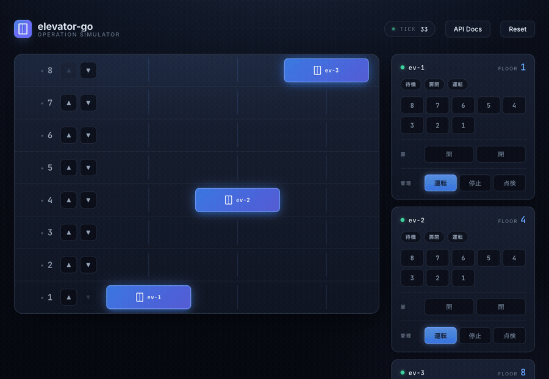

# elevator-go

Go で実装したエレベーター運行シミュレータ。複数台のエレベーターに対するホール呼び・かご内行先指定・1 tick 進行・状態取得を REST API で提供する。DDD + クリーンアーキテクチャの素振り用プロジェクト。



ブラウザ UI からホールボタン / かご内行先ボタンを操作でき、複数タブを開けば SSE 経由で状態が同期する。

## クイックスタート

```bash
# UI 込みで起動するには初回のみ React をビルド
cd web && pnpm install && pnpm run build && cd ..

go run .
# サーバが :8080 で起動
# UI:         http://localhost:8080/
# Swagger UI: http://localhost:8080/docs
```

サーバは起動と同時に **auto-tick goroutine** を回す（既定 1 秒ごとに `AdvanceTick`）。
変更は `GET /events`（SSE）で全クライアントに配信されるので、複数タブで同じ状態を共有できる。

主要エンドポイント:

| Method | Path | 用途 |
|---|---|---|
| GET    | `/` | React UI（embed） |
| GET    | `/events` | SSE: 接続直後に現在状態 + 以降 tick イベント |
| GET    | `/floors/{floor}/elevators` | n 階から見えるエレベーター |
| POST   | `/floors/{floor}/hall-calls` | ホール呼び（上下ボタン） |
| POST   | `/elevators/{elevatorId}/car-calls` | かご内行先指定 |
| POST   | `/simulation/tick` | 1 tick 進める（手動） |
| POST   | `/simulation/reset` | シミュレーションリセット |
| GET    | `/openapi.json` | OpenAPI 仕様 |
| GET    | `/docs` | Swagger UI |

`/elevators/*/doors/*`, `/stop`, `/resume`, PATCH 系の admin エンドポイントも OpenAPI に定義しているが、未実装の間は 501 を返す。

### 環境変数

| 変数 | 既定 | 用途 |
|---|---|---|
| `ADDR` | `:8080` | リッスンアドレス |
| `TICK_INTERVAL_MS` | `1000` | auto-tick の間隔（ミリ秒） |
| `FLOOR_MIN` / `FLOOR_MAX` | `1` / `10` | 起動時の階数範囲（地下は負値）|
| `ELEVATOR_COUNT` | `2` | 起動時の号機台数（min〜max に等間隔配置）|
| `LOG_FORMAT` | `text` | `json` で構造化 JSON ログ |
| `LOG_DEBUG` | unset | 何か入っていれば DEBUG レベル |

例: `FLOOR_MIN=-2 FLOOR_MAX=20 ELEVATOR_COUNT=4 go run .`

## レイヤ構成

| 層 | パッケージ | 役割 |
|---|---|---|
| ドメイン | `internal/domain/elevator` | Entity / VO / 集約 (ElevatorBank) / Domain Service。stdlib のみ依存。 |
| アプリケーション | `internal/usecase` | Find → 処理 → Save の協調。Clock / IDGenerator / Locker / SimulationClock を Port として宣言。 |
| インフラ | `internal/infrastructure` | in-memory repository、mutex locker、system clock、UUID generator。 |
| インターフェイス | `internal/interface/http` | OpenAPI 生成型 (`oapi/`) と chi ハンドラ (`server/`)。Swagger UI 配信付き。Broadcaster / SSE / AutoTicker / 静的配信もここ。 |
| フロントエンド | `web/` | Vite + React + TypeScript。ビルド出力は `internal/interface/http/server/webdist/` に置かれ、`embed.FS` で同梱される。 |

依存方向: `interface → usecase → domain` および `infrastructure → domain`。逆流はなし。

## 仕様の所在

| 内容 | 場所 |
|---|---|
| API 契約 | [docs/openapi.yaml](docs/openapi.yaml) ←一次ソース |
| ドメイン設計 | [docs/domain.md](docs/domain.md) |
| 振る舞い仕様 | [docs/behavior.md](docs/behavior.md) |
| テストケース | [docs/test-cases.md](docs/test-cases.md) |
| API 解説 | [docs/api.md](docs/api.md) |

## 開発

### ビルド・テスト

```bash
go build ./...
go vet ./...
go test ./...
```

### OpenAPI 仕様変更時のフロー

1. `docs/openapi.yaml` を編集
2. `go generate ./...` で `internal/interface/http/oapi/api.gen.go` を再生成
3. 必要に応じて `internal/interface/http/server/handler.go` のメソッドを実装/修正

### フロントエンド開発

```bash
cd web
pnpm install                      # 初回のみ
pnpm run dev                      # Vite dev server (5173)、API は :8080 へ proxy
pnpm run build                    # internal/interface/http/server/webdist/ にビルド出力
```

`pnpm run build` 後に `go run .` で再起動すると最新 UI が embed される。

### 新しいエンドポイントの実装

`server.Handler` は `oapi.Unimplemented` を埋め込んでいるので、未実装エンドポイントは 501 を返す。新規実装は対応するメソッドをオーバーライドして UseCase を呼ぶだけ。

エラーマッピングは `internal/interface/http/server/errors.go` の `errorMapping` テーブル一カ所に集約。ハンドラは `writeError(w, err)` を呼ぶだけで適切な HTTP コードに変換される。

## 設計方針

- **ドメインは純粋**: stdlib のみ。HTTP・DB・wall clock・ID 生成への依存ゼロ。
- **時刻と ID は外部注入**: テストで決定論的に差し替え可能。
- **集約 (ElevatorBank) が不変条件を担保**: 範囲・冪等・割当成功。
- **配車は決定論**: 距離 → idle 優先 → ID 昇順。ログから再現可能。
- **並行制御は usecase.Locker**: ドメインも Repository もロックを持たない。
- **エラーマッピングは一元**: ドメイン sentinel → HTTP コード対応は 1 ファイル。

## テスト

ドメイン層 56 件、usecase 層 9 件で計 65 件。Scenario A（単独号機の往復）と Scenario B（2 号機の振り分け）を結合テストとして含む。

```bash
go test -v ./...
```

## ライセンス

未定。
