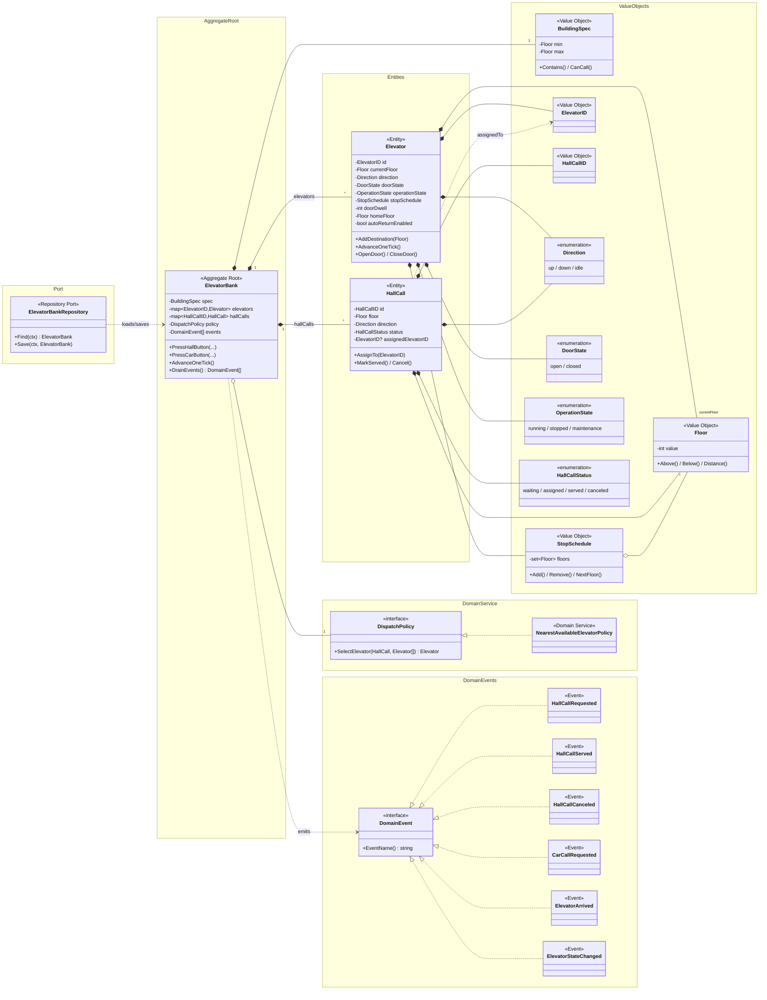

# Elevator ドメイン設計

`docs/api.md` の API を、戦略的 DDD + クリーンアーキテクチャで実装するためのドメインモデル設計。

## 1. 戦略的 DDD

### コアドメイン

```text
エレベーター配車・運行制御 (Elevator Dispatching / Operation)
```

複数の呼び出しに対し、どのエレベーターを割り当て、どの順で動かし、どの状態を利用者に見せるか — が本質。CRUD ではない。

### 境界づけられたコンテキスト

MVP では 1 コンテキストに集約する:

```text
Elevator Operation Context
```

責務: 状態管理 / ホール呼び受付 / 行き先指定受付 / 配車 / tick 進行 / 可視状態の生成

将来分割候補（今は分けない）:

| Context                       | 責務                              |
|-------------------------------|---------------------------------|
| Building Management Context   | 建物・階・運行時間帯                  |
| Maintenance Context           | 点検・停止・異常・復旧                 |
| Monitoring Context            | ログ・メトリクス・稼働状況              |
| Simulation Context            | tick・リセット・シナリオ実行            |
| User Interface Context        | フロア表示盤・かご内表示              |

### ユビキタス言語

| 用語              | 意味                       |
|-----------------|--------------------------|
| Elevator        | エレベーターのかご               |
| Floor           | 階（地下は負値）                |
| Hall Call       | フロアの上下ボタン押下             |
| Car Call        | かご内の行き先ボタン押下            |
| Direction       | 上昇 / 下降 / 停止             |
| Door State      | ドア状態                     |
| Operation State | 運行状態                     |
| Dispatch        | 呼び出しにエレベーターを割り当てる行為   |
| Stop Schedule   | 停止予定階の集合                |
| Tick            | シミュレーションの 1 ステップ        |
| Visible Status  | n 階にいる人から見える派生状態         |

---

## 2. アーキテクチャ

### 依存方向

```text
interface/http  →  usecase  →  domain
                       ↑
              infrastructure (実装で domain の interface を満たす)
```

`domain` は DB / HTTP / JSON / フレームワークに依存させない。

### パッケージ構成

```text
internal/
  domain/
    elevator/
      building_spec.go
      direction.go
      door_state.go
      operation_state.go
      floor.go
      elevator_id.go
      hall_call.go
      hall_call_id.go
      hall_call_status.go
      stop_schedule.go
      elevator.go
      elevator_bank.go
      dispatch_policy.go
      nearest_elevator_policy.go
      visible_status.go
      repository.go
      errors.go
      events.go            # MVP では空でも可
  usecase/
    press_hall_button.go
    press_car_button.go
    advance_tick.go
    reset_simulation.go
    get_visible_elevators.go
  interface/http/
    handler/
    presenter/
    request/
    response/
  infrastructure/
    persistence/memory/
      elevator_bank_repository.go
    clock/
    id/
```

---

## 3. モデル全体像

```text
ElevatorBank (Aggregate Root)
├── BuildingSpec (VO)
├── Elevator[] (Entity)
│   ├── ElevatorID (VO)
│   ├── Floor (VO)               -- currentFloor
│   ├── Direction (VO)
│   ├── DoorState (VO)
│   ├── OperationState (VO)
│   └── StopSchedule (VO)
├── HallCall[] (Entity)
│   ├── HallCallID (VO)
│   ├── Floor (VO)
│   ├── Direction (VO)
│   ├── HallCallStatus (VO)
│   └── ElevatorID? (assigned)
└── DispatchPolicy (Domain Service)
```

`CarCall` は独立 Entity ではなく、`Elevator.StopSchedule` への追加として表現する（点灯状態は `StopSchedule` に含まれているか否かで決まる）。

### クラス図



> 集約境界・Entity/VO 区別・Event の派生関係は機械的には拾えないので手書きで意味づけしている。
> 構造（フィールド・シグネチャ）に変化があったら手で追従する。

---

## 4. Aggregate 設計判断

### Aggregate Root: `ElevatorBank` を採用

| 観点              | 判断                                                            |
|-----------------|---------------------------------------------------------------|
| API の主な単位    | `/floors/{floor}/elevators`、`/simulation/tick` など建物全体に近い   |
| 配車ロジック      | 複数台にまたがる判断なので、束ねる Root が必要                          |
| 整合性           | ホール呼びの重複防止・割当はバンク全体の不変条件                          |

`Elevator` を Root にすると配車が外部 Domain Service に逃げて、トランザクション境界が曖昧になる。MVP では `ElevatorBank` 一括で扱う。

### 不変条件（ElevatorBank が守る）

- 同じ `(floor, direction)` で `waiting`/`assigned` の `HallCall` は同時に 1 つまで
- ホール呼びは必ず `running` のエレベーターに割り当てる、または割当不可エラー
- `HallCall.assignedElevatorID` が指す `Elevator` は必ず `elevators` に存在する
- `Elevator.StopSchedule` は `BuildingSpec.Contains` を満たす階のみを含む

---

## 5. Value Object

### Floor

階番号は `int` の裸ではなく VO で包む。**地下対応のため `value < 1` を弾かない**（既存の `FloorRange{Min:-2, Max:20}` 仕様に合わせる）。範囲チェックは `BuildingSpec` の責務にする。

```go
type Floor struct{ value int }

func NewFloor(v int) Floor              { return Floor{value: v} }
func (f Floor) Value() int              { return f.value }
func (f Floor) Above() Floor            { return Floor{f.value + 1} }
func (f Floor) Below() Floor            { return Floor{f.value - 1} }
func (f Floor) Equals(o Floor) bool     { return f.value == o.value }
```

> 注: 0 階を「無効」として扱うかは建物仕様次第（多くのビルで 0 階はない）。これは `BuildingSpec` のバリデーションで判定する。

### ElevatorID / HallCallID

```go
type ElevatorID string
type HallCallID string
```

空文字検証は `New*` で行う。

### Direction

```go
type Direction string

const (
    DirectionUp   Direction = "up"
    DirectionDown Direction = "down"
    DirectionIdle Direction = "idle"
)

func (d Direction) IsMoving() bool { return d == DirectionUp || d == DirectionDown }
```

### DoorState

```go
type DoorState string

const (
    DoorStateOpen    DoorState = "open"
    DoorStateOpening DoorState = "opening"
    DoorStateClosed  DoorState = "closed"
    DoorStateClosing DoorState = "closing"
)
```

### OperationState

```go
type OperationState string

const (
    OperationStateRunning     OperationState = "running"
    OperationStateStopped     OperationState = "stopped"
    OperationStateMaintenance OperationState = "maintenance"
)
```

### HallCallStatus

```go
type HallCallStatus string

const (
    HallCallStatusWaiting  HallCallStatus = "waiting"
    HallCallStatusAssigned HallCallStatus = "assigned"
    HallCallStatusServed   HallCallStatus = "served"
    HallCallStatusCanceled HallCallStatus = "canceled"
)
```

### StopSchedule

停止予定階の集合。順序は持たず重複排除のみ（移動方向は `Elevator.recalculateDirection` で決める）。

```go
type StopSchedule struct{ floors map[int]Floor }

func NewStopSchedule() StopSchedule
func (s *StopSchedule) Add(f Floor)
func (s *StopSchedule) Remove(f Floor)
func (s StopSchedule) Has(f Floor) bool
func (s StopSchedule) IsEmpty() bool
func (s StopSchedule) Floors() []Floor
```

### BuildingSpec

```go
type BuildingSpec struct{ minFloor, maxFloor Floor }

func NewBuildingSpec(min, max Floor) (BuildingSpec, error)  // min < max を要求
func (b BuildingSpec) Contains(f Floor) bool
func (b BuildingSpec) CanCall(f Floor, d Direction) bool    // 最上階 up / 最下階 down を弾く
```

---

## 6. Entity: Elevator

```go
type Elevator struct {
    id             ElevatorID
    currentFloor   Floor
    direction      Direction
    doorState      DoorState
    operationState OperationState
    stopSchedule   StopSchedule
}
```

### 責務（自分自身の状態遷移のみ）

- `AddDestination(Floor)` — 行き先追加（同階なら開扉、`running` 以外なら拒否）
- `AdvanceOneTick()` — 1 tick 分の状態遷移（ドア閉→1 階移動→到着なら開扉）
- ドア開閉、方向再計算は内部メソッド

`ElevatorBank` をまたがる判断（割当・重複検知）は持たせない。

### Tick の状態遷移仕様

優先順:
1. `operationState != running` → 何もしない
2. `doorState == open` → 閉扉に進める（`closing` 経由）
3. `stopSchedule.IsEmpty()` → `direction = idle`、終了
4. 次の停止階に向け 1 階移動 → 到着したら `Remove` + 開扉

ドア開閉を 1 段階遷移 (`opening` → `open` → `closing` → `closed`) にするか即時にするかは MVP の選択。**MVP では即時 (`open`/`closed` の 2 値)** で開始し、後でリッチ化する。

---

## 7. Entity: HallCall

```go
type HallCall struct {
    id                 HallCallID
    floor              Floor
    direction          Direction      // up / down のみ（idle 不可）
    status             HallCallStatus
    assignedElevatorID *ElevatorID
}
```

### ふるまい

- `AssignTo(ElevatorID)` — `assigned` に遷移
- `MarkServed()` — `served` に遷移
- `Cancel()` — `served` 以外なら `canceled`（`served` は不変）

---

## 8. Aggregate Root: ElevatorBank

```go
type ElevatorBank struct {
    spec      BuildingSpec
    elevators map[ElevatorID]*Elevator
    hallCalls map[HallCallID]*HallCall
    policy    DispatchPolicy
}
```

### 公開メソッド（API ⇄ UseCase 経由で呼ばれる）

| メソッド                                              | API 対応                               |
|---------------------------------------------------|--------------------------------------|
| `PressHallButton(id, floor, dir) (*HallCall, error)` | `POST /floors/{floor}/hall-calls`      |
| `PressCarButton(elevatorID, dest) error`           | `POST /elevators/{id}/car-calls`       |
| `AdvanceOneTick()`                                | `POST /simulation/tick`                |
| `VisibleElevatorsFrom(floor) ([]VisibleElevator, error)` | `GET /floors/{floor}/elevators`        |

### `PressHallButton` の手続き

```text
1. BuildingSpec.CanCall で範囲・方向を検証
2. 同じ (floor, direction) で active な呼びがあれば既存を返す（冪等）
3. 新規 HallCall を作成
4. DispatchPolicy.SelectElevator で割当先を決定
5. HallCall.AssignTo + Elevator.AddDestination
6. hallCalls に登録
```

### `AdvanceOneTick` の手続き

```text
1. すべての Elevator に AdvanceOneTick を委譲
2. assigned な HallCall について「割当エレベーターが該当階で開扉」なら MarkServed
```

---

## 9. Domain Service: DispatchPolicy

配車アルゴリズムは差し替え可能にする。

```go
type DispatchPolicy interface {
    SelectElevator(call HallCall, elevators []*Elevator) (*Elevator, error)
}
```

### MVP 実装: NearestElevatorPolicy

`running` のエレベーターのうち、現在階と呼び出し階の絶対距離が最小のものを選ぶ。候補なしなら `ErrNoAvailableElevator`。

将来候補: 進行方向考慮、待ち時間最小化、SCAN/LOOK アルゴリズム。

---

## 10. Read Model: 可視状態

API レスポンス用の派生モデル。Domain Entity ではなく **Read Model** として分離する。

理由: UI 都合で変わりやすく、内部状態と必ずしも 1:1 ではない。

```go
type VisibleElevatorStatus string

const (
    VisibleStatusArrived     VisibleElevatorStatus = "arrived"
    VisibleStatusApproaching VisibleElevatorStatus = "approaching"
    VisibleStatusPassing     VisibleElevatorStatus = "passing"
    VisibleStatusAway        VisibleElevatorStatus = "away"
    VisibleStatusUnavailable VisibleElevatorStatus = "unavailable"
)

type FloorVisibleElevator struct {
    ElevatorID    ElevatorID
    CurrentFloor  Floor
    Direction     Direction
    DoorState     DoorState
    VisibleStatus VisibleElevatorStatus
}
```

### VisibleStatus の判定

```text
operationState != running              → unavailable
currentFloor == viewer && doorState=open → arrived
direction=up   && currentFloor < viewer → approaching
direction=down && currentFloor > viewer → approaching
currentFloor == viewer (上記以外)         → passing
それ以外                                  → away
```

---

## 11. Repository

`domain/elevator` に Interface を置く。実装は `infrastructure/persistence/memory` 等。

```go
type ElevatorBankRepository interface {
    Find(ctx context.Context) (*ElevatorBank, error)
    Save(ctx context.Context, bank *ElevatorBank) error
}
```

MVP では「建物 1 棟」前提で ID なし。複数棟対応時に `BuildingID` を導入する。

---

## 12. UseCase

「API 操作 1 個 = UseCase 1 個」で対応させる。

| UseCase                     | Input (DTO)                                    | Output (DTO)               |
|---------------------------|-------------------------------------------------|--------------------------|
| `PressHallButtonUseCase`    | `{Floor int, Direction string}`                  | `{CallID, Floor, Direction, Status, AssignedElevatorID}` |
| `PressCarButtonUseCase`     | `{ElevatorID string, DestinationFloor int}`      | `error` のみ（成功時は値なし）  |
| `AdvanceTickUseCase`        | なし                                              | tick 結果（任意）         |
| `GetVisibleElevatorsUseCase`| `{Floor int}`                                    | `{Floor, []VisibleElevatorOutput}` |
| `ResetSimulationUseCase`    | `{FloorRange, ElevatorCount}`                    | 初期化結果                |

UseCase の責務:

1. Repository から Aggregate を取得
2. 入力 DTO を VO に変換
3. ドメインメソッドを呼ぶ
4. Repository に保存
5. 出力 DTO に変換

ドメインルールは UseCase に書かない。

> **HTTP レスポンス組み立て**: `PressCarButtonUseCase` のように出力 DTO を持たない UseCase でも、HTTP 層では固定形式 (`{elevatorId, destinationFloor, status: "accepted"}` 等) のレスポンスを返す。これは Presenter / Handler の責務として組み立て、UseCase 自体には持ち込まない。

---

## 13. エラー定義

```go
var (
    ErrInvalidFloor             = errors.New("invalid floor")              // 範囲外階（hall / car 共通）
    ErrInvalidElevatorID        = errors.New("invalid elevator id")
    ErrInvalidHallCallDirection = errors.New("invalid hall call direction") // 最上階 up / 最下階 down / idle 等の方向違反
    ErrInvalidDestinationFloor  = errors.New("invalid destination floor")
    ErrInvalidDirection         = errors.New("invalid direction")           // PATCH の direction 検証
    ErrInvalidDoorState         = errors.New("invalid door state")          // PATCH の doorState 検証（open / closed のみ許可）
    ErrInvalidOperationState    = errors.New("invalid operation state")     // PATCH の operationState 検証
    ErrElevatorNotFound         = errors.New("elevator not found")
    ErrElevatorAlreadyExists    = errors.New("elevator already exists")     // reset 入力の重複 ID
    ErrElevatorNotRunning       = errors.New("elevator is not running")
    ErrNoAvailableElevator      = errors.New("no available elevator")
    ErrInvalidBuildingSpec      = errors.New("invalid building spec")
)
```

`interface/http` 層で `docs/api.md` §1 のエラーコードへマッピングする。

| Domain Error                  | HTTP code             | HTTP status |
|------------------------------|-----------------------|-------------|
| `ErrInvalidFloor` / `ErrInvalidDestinationFloor` | `OUT_OF_RANGE`        | 400         |
| `ErrInvalidHallCallDirection` | `INVALID_DIRECTION`   | 400         |
| `ErrInvalidDirection`         | `INVALID_REQUEST`     | 400         |
| `ErrInvalidDoorState`         | `INVALID_REQUEST`     | 400         |
| `ErrInvalidOperationState`    | `INVALID_REQUEST`     | 400         |
| `ErrElevatorAlreadyExists`    | `INVALID_REQUEST`     | 400         |
| `ErrElevatorNotFound`         | `ELEVATOR_NOT_FOUND`  | 404         |
| `ErrElevatorNotRunning` / `ErrNoAvailableElevator` | `INVALID_STATE`       | 409         |

現在階を行き先指定した Car Call はエラーではなく即時開扉で受け付ける
（`docs/behavior.md` §5）。専用のエラーコードは持たない。

---

## 14. Domain Event（後回し）

MVP では発行しない。将来の通知・ログ向けにシグネチャだけ定義しておく。

```go
type DomainEvent interface{ EventName() string }

type HallCallRequested struct{ CallID HallCallID; Floor Floor; Direction Direction }
type HallCallAssigned  struct{ CallID HallCallID; ElevatorID ElevatorID }
type ElevatorArrived   struct{ ElevatorID ElevatorID; Floor Floor }
type DoorOpened        struct{ ElevatorID ElevatorID; Floor Floor }
```

---

## 15. API ⇄ UseCase ⇄ Domain 対応表

| API                                    | UseCase                       | Domain メソッド                         |
|----------------------------------------|-------------------------------|---------------------------------------|
| `GET /floors/{floor}/elevators`        | `GetVisibleElevatorsUseCase`  | `ElevatorBank.VisibleElevatorsFrom`   |
| `POST /floors/{floor}/hall-calls`      | `PressHallButtonUseCase`      | `ElevatorBank.PressHallButton`        |
| `POST /elevators/{id}/car-calls`       | `PressCarButtonUseCase`       | `ElevatorBank.PressCarButton`         |
| `POST /simulation/tick`                | `AdvanceTickUseCase`          | `ElevatorBank.AdvanceOneTick`         |
| `POST /simulation/reset`               | `ResetSimulationUseCase`      | `NewElevatorBank`                     |

---

## 16. 責務サマリ

| 層                | 責務                                                                  |
|-----------------|----------------------------------------------------------------------|
| Handler         | path/JSON の入出力、エラー → HTTP ステータス変換                              |
| UseCase         | Repository 経由のロード/保存、DTO ⇄ VO 変換、ドメインメソッド呼び出し                |
| Aggregate Root  | 集約全体の整合性、複数 Entity をまたぐ振る舞い（配車・重複検知・tick 集約）           |
| Entity          | 自分自身の状態遷移（Elevator のドア・移動、HallCall の status 遷移）              |
| Value Object    | 不変な値、自己バリデーション、ドメイン的な小さな振る舞い                            |
| Domain Service  | 単一 Entity に収まらないアルゴリズム（DispatchPolicy）                            |
| Repository      | 永続化の抽象化（Find/Save）                                                 |
| Read Model      | 表示用の派生モデル（VisibleStatus 等）                                       |

---

## 17. MVP スコープ

実装する最小セット:

```text
VO:        Floor, ElevatorID, HallCallID, Direction, DoorState,
           OperationState, HallCallStatus, StopSchedule, BuildingSpec
Entity:    Elevator, HallCall
Root:      ElevatorBank
Service:   DispatchPolicy + NearestElevatorPolicy
Repo:      ElevatorBankRepository (memory 実装)
Read:      FloorVisibleElevator, VisibleElevatorStatus
UseCase:   PressHallButton / PressCarButton / AdvanceTick / GetVisibleElevators
Handler:   API §4.1 の MVP 4 本
```

スコープ外（後続）:
- Domain Event 発行
- ドアの多段遷移 (`opening`/`closing`)
- `PATCH /elevators/{id}` などの管理 API
- 複数棟対応 (`BuildingID`)
- 進行方向を考慮した配車アルゴリズム

---

## 18. 既存コードからの差分

現状 (`elevator/elevator.go`) は以下の点でこの設計と乖離している。MVP 実装時に解消する。

| 既存                                              | 本設計                                              |
|------------------------------------------------|-------------------------------------------------|
| `package elevator` がトップ階層                       | `internal/domain/elevator` 配下に移動                  |
| `Direction` が `int` (`DirNone/Up/Down`)         | `string` 化（API JSON と直結）                       |
| `Floor` は `int` の裸                              | `Floor` VO 化                                     |
| `InMemoryElevator` が `Elevator` インターフェースを実装    | `Elevator` を Entity 化、`ElevatorBank` を Aggregate Root に             |
| ドア状態 / 運行状態が未表現                                 | `DoorState` / `OperationState` を導入                 |
| `HallCall` / `StopSchedule` が概念として存在しない          | Entity / VO として明示化                              |
| 範囲外検証は `FloorRange.Contains`                    | `BuildingSpec.Contains` / `CanCall` に集約          |

書き換えではなく `internal/domain/elevator` を新設し、現 `elevator/` パッケージは段階的に置き換える方針。
